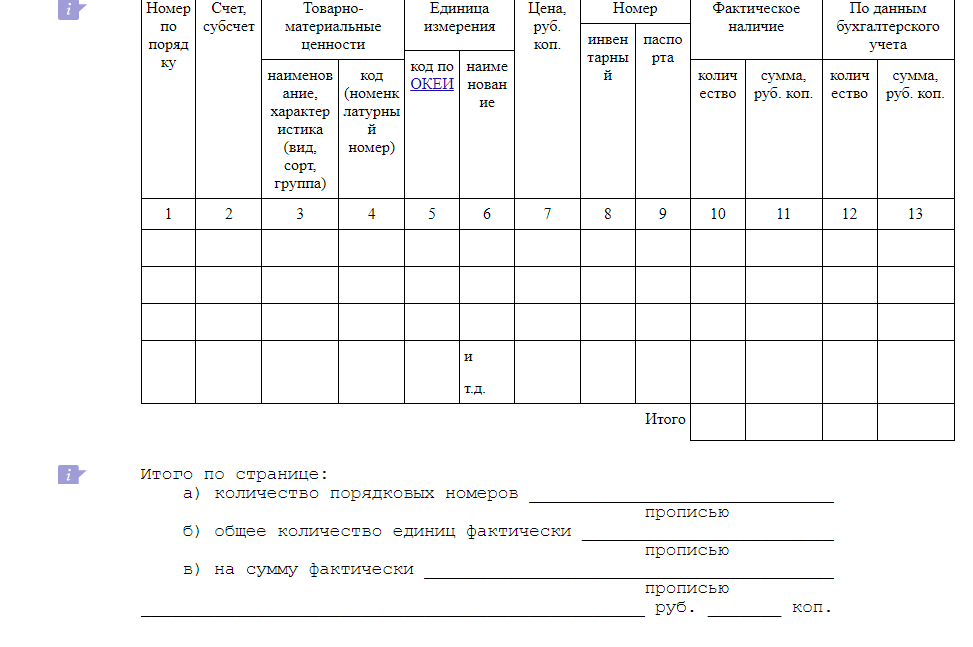

# Пример кода - формирование ИНВ3

Програмка формирует из набора данных файл Excel:
- каждые 16 строк прописываются в табличке (подобие представлено на картинке);

- после каждых 16 строк выводятся постраничные итоги;

- в конце выводятся общие итоги.

